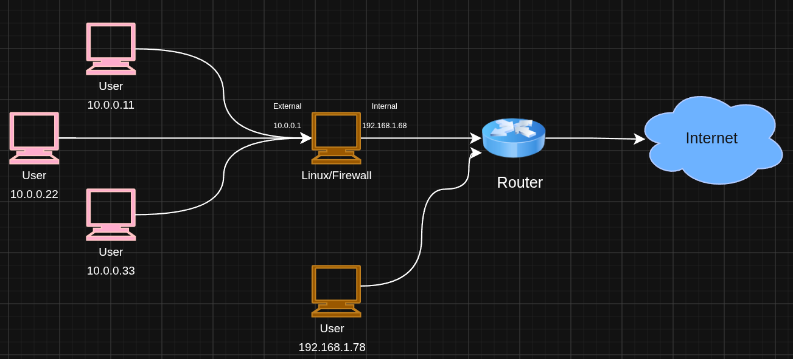

# Linux Router & Stateful Firewall

Become a linux as a Router and a Firewall

## Topology 

## Requeriments 
- 

## Installation and deploy 

## Troubleshooting 

  
Operation not supported 

  cuando la interfaz no admite modo acces point 

  
Problema 2

